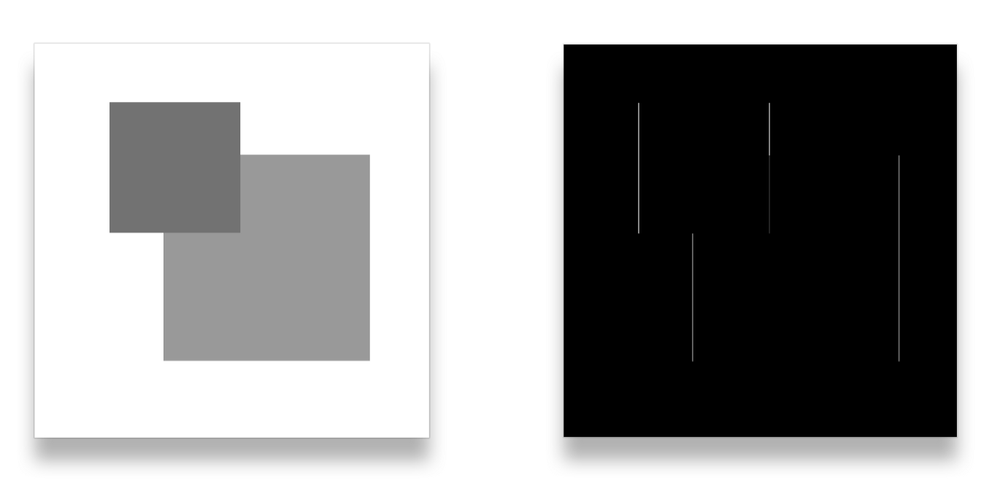
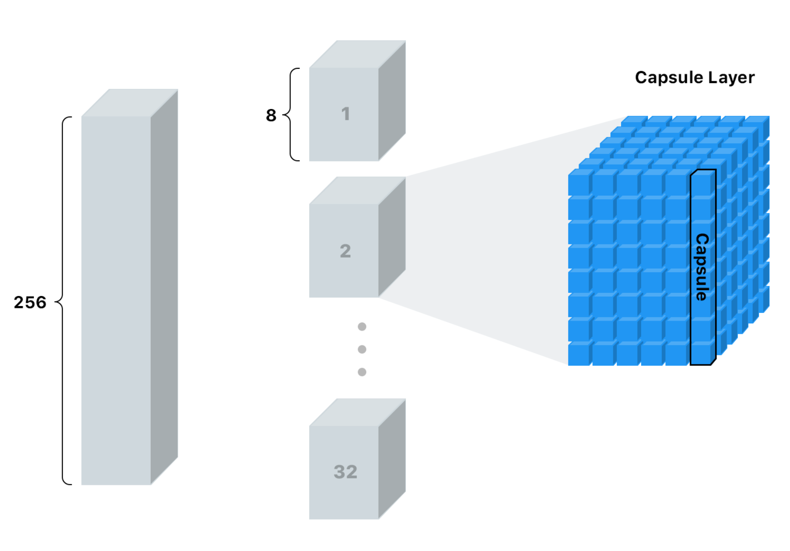
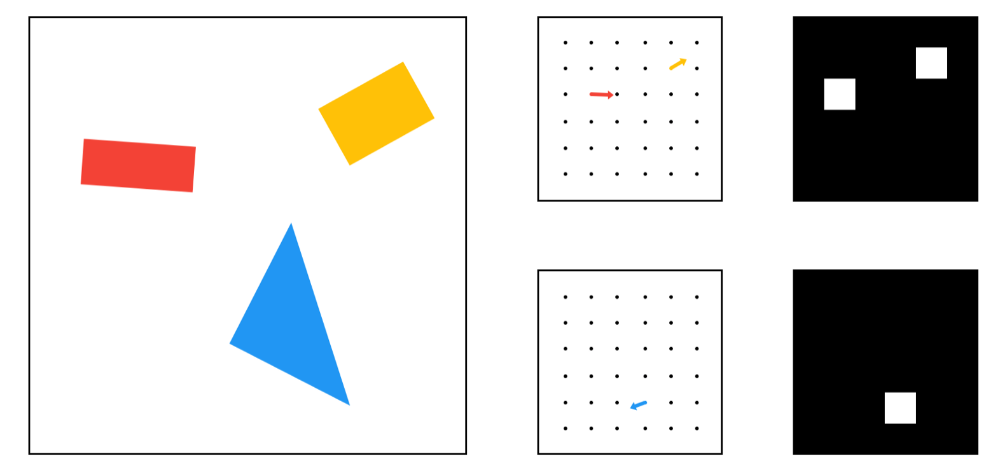
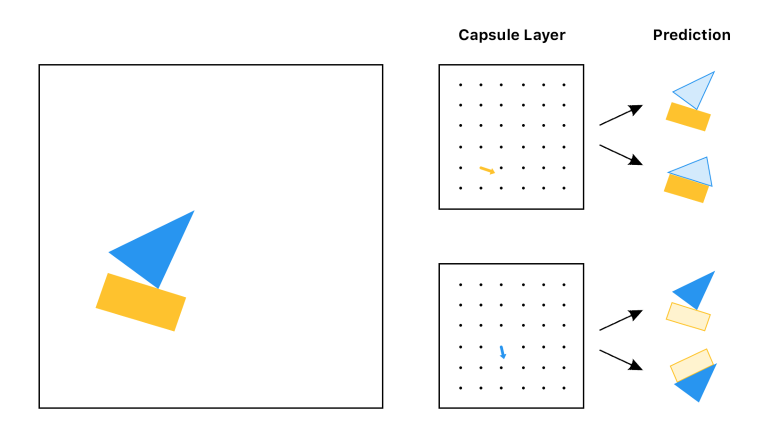
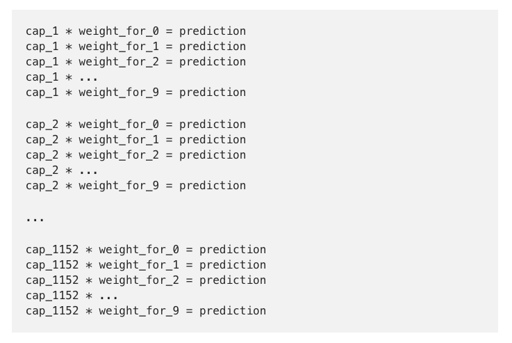
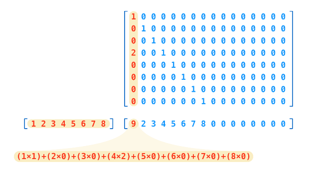
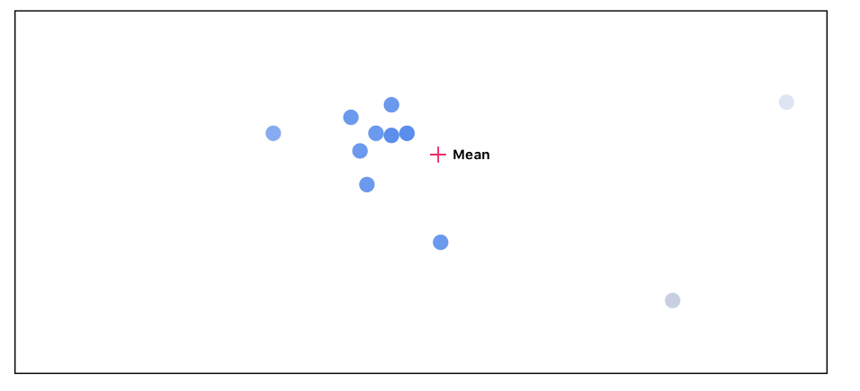
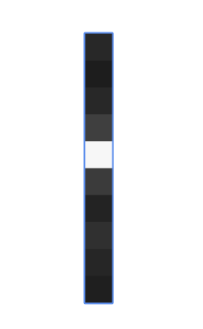
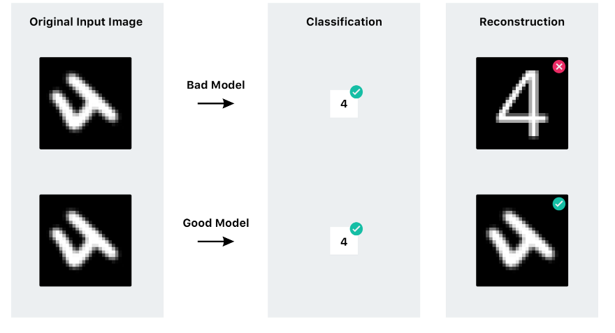

## Convolutional Network의 단점

* CNN은 지금까지 이미지 인식과 분류에 있어서 가장 좋은 성능을 보이는 기법.
* CNN은 크게 convolution을 통해서 개념을 추상화성하고, max pooling을 통해 **transitional invariance** 를 달성함
* 하지만, max-pooling의 경우, transitional invariance를 달성하기 위해 너무 많은 정보를 없애버리는 효과를 냄

## How Capsnet works
 * 전반적으로 다음과 같은 architecture을 지님

### Convolution Layer
 * filter에 따라 해당 위치의 성질을 뽑아냅니다.
 * 만약 filter가 세로 선을 인식하는 filter라면 세로 선이 있는 영역만 큰 값을 가짐.

 * 이미지에 얼마나 많은 종류의 직선, 곡선, 윤곽선들이 있는지 알 수가 없으므로, 많인 filter를 사용함. (논문에서는 256개의 filter)
 * 각 filter에 좀더 다양한 패턴을 답기 위해서 $9\times 9$ 크기의 filter를 논문에서는 사용
 * 다음은 학습이 완료된 후의 256개의 kernel의 예시

 * 위의 filter를 적용해서 나온 convolution layer의 feature map은 위의 패턴이 존재하는 영역에서는 큰 값을, 위의 패턴이 존재하지 않는 영역에서는 작은 값을 가짐

 * $9\times 9$의 filter를 적용했으므로, feature map의 크기는 $28 - 9 + 1 =20$ 차원임.
 * 여기에 RELU를 적용하면 다음과 같은 filter를 얻을 수 있음

 * 이렇게 256개의 filter를 같은 이미지에 적용하고 나면 $20\times 20$차원의 256개 feature map이 생기고, 여기에서 한번더 $9\times 9 \times 256$ kernel을 적용시킴.
   - $6 \times 6$의 feature map을 256개 만들어냄.
   - $6 \times 6$의 feature map 중 1개의 feature map을 다음과 같이 생각할 수 있음

### Primary Capsule Layer

* 여기에서 256개의 feature map을 8개씩 묶어서 하나의 단위로 생각할 수 있고, 이것이 **capsule** 임

* 이제 8개의 숫자로 이루어진 **capsule** 을 새로운 하나의 **pixel** 처럼 보는 것
  - 다음 capsule로 넘기는 과정에서 이 8개의 숫자에는 같은 weight값을 줌으로써, 하나의 pixel처럼 취급할 것임 (Weight 값(*coupling coefficient* )을 찾는 과정이 max-pooling에 대응하는 dynamic routing 방법임)
  - 이 8차원 벡터는 각각 어떠한 object를 나타내고, 벡터의 **길이** 는 해당 object일 **확률** 을 뜻하고, vector의 **방향** 은 object를의 **상태 정보** 를 의미함.

* 개념적으로 캡슐과 pixel의 차이는 아래와 같이 설명할 수 있음
  - 먼저 2개의 shape만 존재한다고 하고, 이 두 가지 도형을 구분할 줄 아는 capsule 유형이(논문에서는 32개의 types of capsule이 있음) 각각 존재하고, 그 capsule이 3차원 벡터로 표시된다고 가정
  -  또한 3차원 중 1차원은 도형의 색깔, 2차원은 도형의 방향이 기록되어 있다고 단순화 시키면, capsule은 가운데 그림처럼 표시를 할 수 있음

* 벡터의 길이는 얼마나 높은 확률로 해당 도형이 있는지를 의미함
  - 빨간 색 예를 들어 보면, `왼쪽 중앙에 높은 확률로 수평으로 놓여 있다.` 정도를 의미
  - 가장 오른쪽의 그림은 원래 이미지에 사각형과 삼각형 filter를 적용한 경우의 그림으로 위치 정보만 있음

> Summary: 256개의 object로 인식하는 대신, capsule을 적용함으로써, 32개의 추상화된 개념의 상태정보를 8개의 차원 벡터에 담을 수 있게 됨
> 이미지에 국한해서 볼 때에는 8차원 벡터가 담는 정보는 object의 위치, 크기, 방향, 흐릿함, 운동성, 반사 정도, 색상, 질감 등이 있음

#### Dynamic routing
* Coupling coefficient를 찾아내는 과정
* Routing by agreement 방법으로 dynamic routing을 진행함
  - 현재 layer에 비해 다음 layer에서 보다 추상적인 개념의 object를 인식할텐데, 여기서는 집, 보트를 인식하는 캡슐이 다음 layer에 있다고 생각해보면,
  - 지금 layer는 boat로 인식하는 capsule로 가는 가중치를 더욱 크게 받을 가능성이 큼

* 이전 layer에서 다음 layer로 넘기는 과정은 현재 layer의 capsule에 weight를 곱함으로써 진행됨
  - 논문에서는 8차원에서 16차원으로 넘기기 위해 $dim(W_{ij}) = 8 \times 16$이었음
  - $6 \times 6 \times 32 = 1152$개 capsule에 대해 선형 변환을 실시함
    - 그러니까 1152개의 $8 \times 16$ 짜리 weight matrix가 존재함

* 각각의 capsule은 다음의 계산 과정을 거쳐서 다음 layer의 capsule로 변환됨

> 여기서 중요한건 1152개의 변환된 capsule(다음 layer의 capsule의 크기와 같음)을 어떻게 그 다음 layer의 capsule로 보낼 것인가 하는 것으로, 이것이 `routing by agreement`임

* 다음과 같이 posterior를 찾아가는 과정으로 해석하기도 함

* 알고리즘 개요

#### Squashing

* 벡터의 방향은 변환하지 않고 길이만 변환하는 변환으로, 0과 1 사이의 값을 지님
* 기존에는 각 node의 값이 scalar였으므로, CNN에는 없던 개념이나, capsule의 상태는 변형시키지 않되 확실성에 대한 정보만 확률로 가공하여 넘기기 위한 방법

$$v_j = \frac{||s_j||^2}{1 + ||s_j||^2}\cdot \frac {s_j}{||s_j||}$$

* sigmoid function처럼 비선형 변환을 하는 역할을 하고 있음

### Digitcap

* agreement 값을 통해, coupling coefficient를 찾아내면, digitcap이 완성이 됨

* 10개의 문자를 분류하므로, 10개의 capsule이 존재하고 각각은 16차원의 값을 지님

* 다음의 digitcap은 숫자를 4로 분류하는 capsule임

### Loss Function

#### Marginal Loss
* $k$ 번째 그룹으로 분류될 확률과 실제 Label과의 차이를 measure
* example이 $k$-번째 category에 속하면 $T_k =1$
* 길이가 너무 줄어드는 것을 방지하기 위해 $\lambda$만큼 down-weighting
$$ T_k = \max(0, m^+ - ||v_k||)^2 + \lambda (1 - T_k)\ max(0, ||v_k|| -m^-)^2$$

#### Reconstruction
* 실제 이미지와 예측되 이미지가 얼마나 비슷한지를 measure

* Digitcap에서 가장 좋은 것만 골라서, fully connected network를 태워서 원래의 이미지와의 차이를 measure

### Step by step analysis

### Capsule 의미

* Capsule의 각 dimension은 다음의 링크에서처럼 해석 가능
  - http://210.121.159.217:15000/
