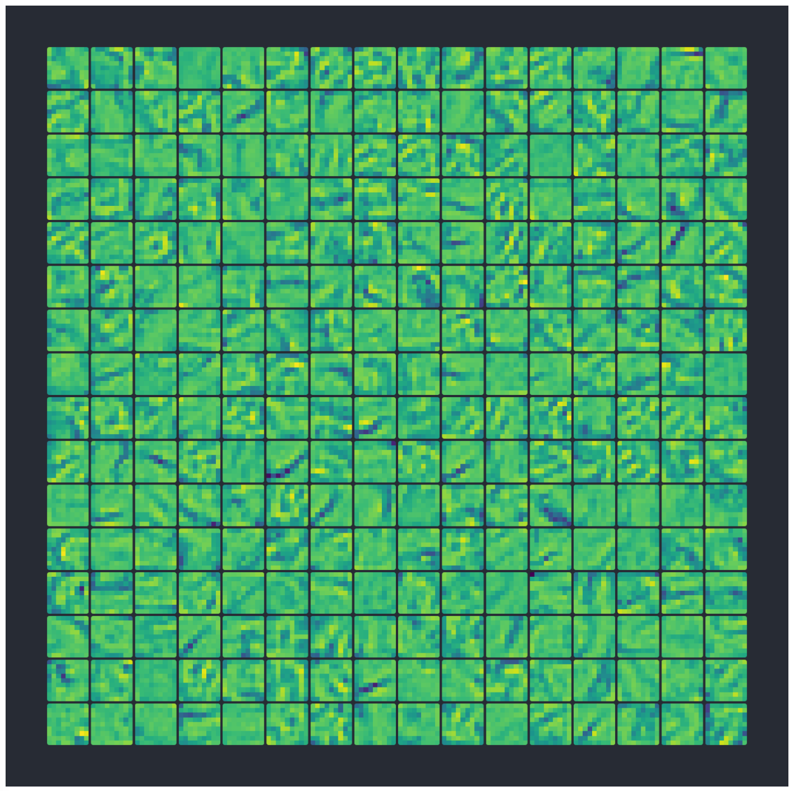
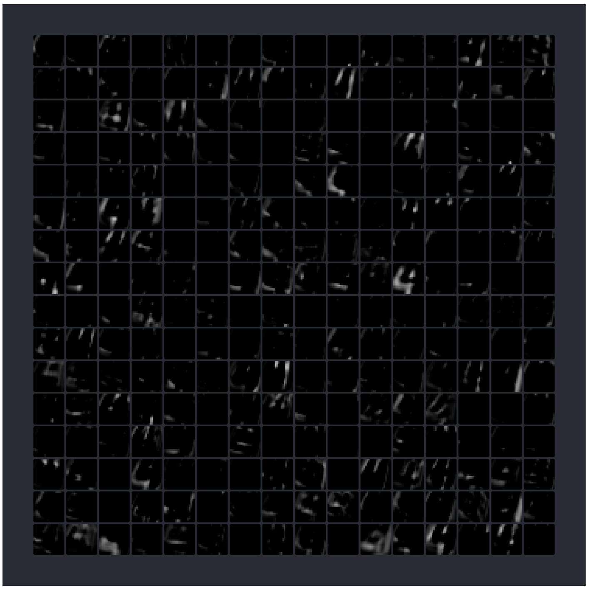

## Convolutional Network의 단점

CNN은 지금까지 이미지 인식과 분류에 있어서 가장 좋은 성능을 보이는 기법입니다. CNN은 크게 convolution을 통해서 transitional equi-variance를 달성하고, max pooling을 통해 transitional invariance를 달성함으로써, 복잡하고 다양한 이미지를 높은 성능으로 분류할 수 있었습니다. equi-variance는 이미지에 나타나 있는 object의 위치가 어디에 있든지 object를 인식하도록 하는 것이고, invariance는 약간 변형된 object도 object로 인식하도록 강건성을 부여하는 것입니다. 하지만, max-pooling의 경우, invariance를 달성하기 위해 너무 많은 정보를 없애버리는 효과를 가지고 있으며, convolution의 경우 어떤 위치의 ojbect를 잘 찾아내기만 하면 되다보니, 위치 정보를 무시하는 결과를 가지고 왔습니다.

CNN은 매 layer에서 정보를 축적함으로써 작동합니다. 최초의 layer에서는 edge를 찾고, 그다음 layer에서는 모양을, 그다음 layer에서는 실제 object를 찾는 식입니다. 하지만, 마지막에 object를 인식하는 단계에서 CNN은 object가 가지고 있어야 할 요소만 가지고 있으면, 우리가 찾는 object로 인정해버리는 단점을 가지고 있습니다. 눈, 코, 입의 위치와는 상관없이 눈, 코, 입이 있기만 하면 얼굴이라고 판단해 버리는거죠. 또한 뒤집어진 사람의 이미지의 경우에는 사람이 아닌 것으로 인식하기도 합니다. 뒤집어진 눈, 코, 입의 모양이 그동안 학습이 되던 모양과는 다르기 때문입니다. 가장 naive한 방법은 모든 각도의 눈, 코, 입을 모두 학습셋으로 만들어 학습을 하는 것이지만, 이것은 거의 불가능한 일입니다. 실제로 이미지를 crop, rotating, scaling을 하여 학습셋을 부풀려 학습을 하기도 합니다.

capsnet은 상대적인 관계를 모두 활용하도록 합니다. 눈, 코, 입이 있어서 되는 것이 아니라, 그들이 제자리에 있어야 얼굴로 인식을 한다는 것입니다.

## How Capsnet works
#### Convolution LayerM
Convolution layer는 이미지에 작은 사이즈의 filter를 순차적으로 적용합니다. filter에 따라 해당 위치의 성질을 뽑아냅니다. 만약 filter가 세로 선을 인식하는 filter라면 세로 선이 있는 영역만 큰 값을 가집니다. 만약 가로선을 인식하려면 다른 filter를 적용합니다.

만약 세로선이 없는 경우에는 위의 filter는 작동하지 않을 것입니다. 우리는 이미지에 얼마나 많은 종류의 직선, 곡선, 윤곽선들이 있는지 알 수가 없으므로, 많인 filter를 사용합니다. (논문에서는 256개의 filter를 사용했습니다.) 각 filter에 좀더 다양한 패턴을 답기 위해서 $9\times 9$ 크기의 filter를 논문에서 사용했습니다. 다음은 학습이 완료된 후의 256개의 kernel의 예시입니다.

위의 filter를 적용해서 나온 convolution layer의 feature map은 위의 패턴이 존재하는 영역에서는 큰 값을, 위의 패턴이 존재하지 않는 영역에서는 작은 값을 가질 것입니다. $9\times 9$의 filter를 적용했으므로, feature map의 크기는 $28 - 9 + 1 =20$ 차원입니다.
여기에 RELU를 적용하면 다음과 같은 filter를 얻을 수 있습니다.

이렇게 256개의 filter를 같은 이미지에 적용하고 나면 $20\times 20$차원의 256개 feature map이 생기고, 여기에서 한번더 $9\times 9 \times 256$ kernel을 적용시킵니다. 256차원의 feature map에 $9\times 9$ 크기의 kernel을 적용시켜야 하기 때문입니다. 이런 과정을 256번 해서 또 다른 $6 \times 6$의 feature map을 256개 만들어냅니다. 그 결과 얻을 수 있는 행렬은 $ 6\times 6 \times 256$ 행렬입니다.

여기에서 256개의 feature map을 8개씩 묶어서 하나의 단위로 생각합니다. 이것이 capsule입니다. 사진의 어느 영역(위의 그림에서는 가장 오른쪽 아래의 영역)에는 32개의 서로 다른 object(성질)를 8개의 값으로 나타내는 capsule이 존재하는 것을 의미합니다. 결국 8개의 숫자로 이루어진 capsule을 새로운 하나의 pixel처럼 보는 것입니다. 앞으로는 다음 capsule로 넘기는 과정에서 이 8개의 숫자에는 같은 weight값을 줌으로써, 하나의 pixel처럼 취급할 것입니다. 이 8차원 벡터의 길이는 해당 object일 확률을 뜻합니다. 만약 오른쪽 아래에 철수가 있다면, 32개의 오른쪽 아래영역에 있는 capsule 중에 철수를 담아내는 capsule의 $L_2$ norm이 가장 클 것입니다. 8차원 vector의 방향은 철수의 상태 정보를 의미합니다. 달리는 철수, 누워있는 철수, 아픈 철수, 찢어진 철수 등.. 만약 오른쪽 아래 영역의 256개의 값을 개별 값으로 인식한다면, 각 값은 각 $9\times 9\times 256$ 크기의 kernel을 적용했을 때 그 kernel(두번째 layer이므로, 해당 영역의 첫번째 layer의 256개 선, edge, 각도들의 결합으로 표현되는 좀 더 추상화된 object)과 얼마나 유사한가만 표현될 것입니다. 그리고 256개의 추상화된 개념과의 유사성이 표현될 것입니다. 하지만 capsule을 적용함으로써, 32개의 추상화된 개념의 상태정보를 8개의 차원에 담을 수 있게 됩니다. 이미지에 국한해서 볼 때에는 8차원 벡터가 담는 정보는 object의 위치, 크기, 방향, 흐릿함, 운동성, 반사 정도, 색상, 질감 등이 되겠습니다.

개념적으로 캡슐과 pixel의 차이는 아래와 같이 설명할 수 있겠습니다.

먼저 2개의 shape만 존재한다고 하고(논문에서는 32개의 types of capsule이 있습니다.), capsule이 3차원 벡터로 표시된다고 하죠. 3차원 중 1차원은 도형의 색깔, 2차원은 도형의 방향이 기록되어 있다고 하면, capsule은 가운데 그림처럼 표시를 할 수 있습니다. 벡터의 길이는 얼마나 높은 확률로 해당 도형이 있는지를 의미합니다. 빨간 색 예를 들어 보면, `왼쪽 중앙에 높은 확률로 수평으로 놓여 있다.` 정도를 의미합니다. 가장 오른쪽의 그림은 원래 이미지에 사각형과 삼각형 filter를 적용한 경우의 그림입니다. 많은 정보가 전달되지 않고 있습니다.

동시에 적용해야 하므로
, 효율성 관점에서 몇가지 큰 단점을 가지고 있습니다.

 을 보입니다. CNN은
